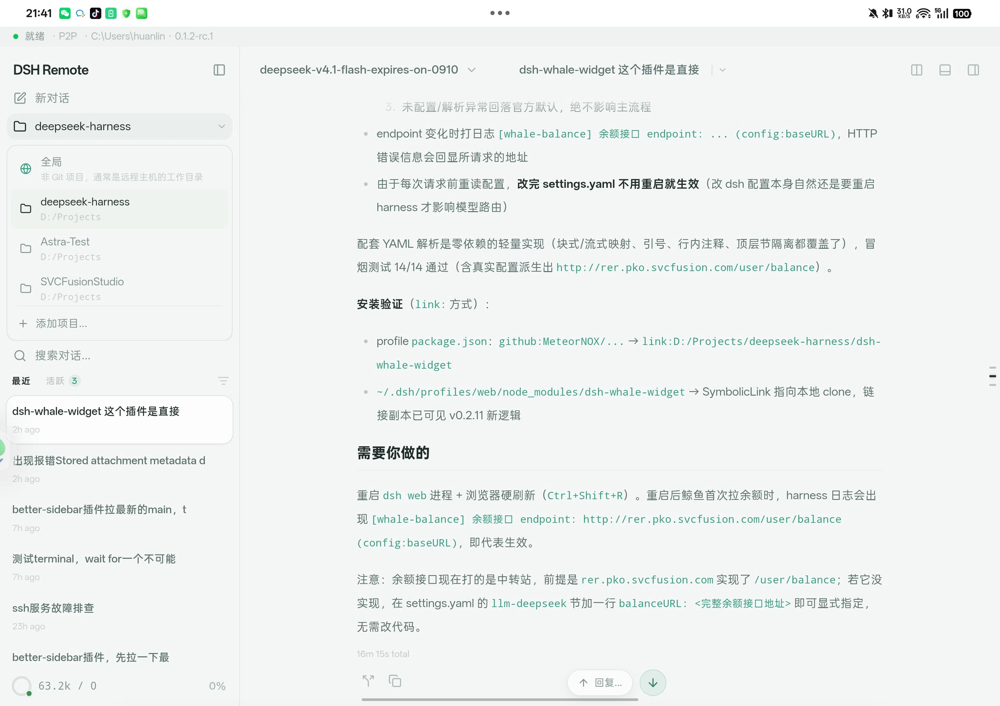

# DSH Remote

中文 | [English](./README_EN.md)

[ds-harness-remote](https://github.com/liguobao/ds-harness-remote) 的**第三方桌面 / Android 客户端**：
登录 DSH Remote Server 账号，选择在线 Host，通过端到端加密（Noise IK）隧道远程操作 DeepSeek Harness ——
发送文本与图片、查看流式回复与工具调用、应答审批与提问、取消任务、切换模型。

界面层**修改自 [OpenCodeUI](https://github.com/lehhair/OpenCodeUI)**（Tauri 2 + React 19，GPL-3.0 衍生作品），
在其聊天渲染 / 多窗格 / 主题 / 移动端布局之上，针对「远程 Host + 移动端」重做了交互体验：
过程折叠、连接路径可视化、后台不掉线、长会话流式不卡顿。

## 与上游的关系

| 上游 | 关系 | 本仓库对它的依赖 |
| --- | --- | --- |
| [lehhair/OpenCodeUI](https://github.com/lehhair/OpenCodeUI) | **UI 上游 / 直接来源** | 前端与桌面壳的起点（聊天渲染、多窗格、终端、主题、Tauri 壳）；本仓库是它的 GPL-3.0 衍生作品，保留原许可证与署名 |
| [liguobao/ds-harness-remote](https://github.com/liguobao/ds-harness-remote) | **协议与服务端上游** | vendor 其 `packages/protocol`、`packages/webrtc`、`packages/client-core`（见 `src/dsh/VENDOR.md`）；本仓库是它的第三方客户端，**不是**官方客户端 |
| `@deepseek-ai/dsh web` | 被远程操作的 Host 运行时 | 官方 npm 包，不属于本仓库 |
| DSH Remote Server | 控制通道 / Relay / Signaling 服务 | 官方部署 <https://dsh.r2049.cn> |

> 本仓库既不是 OpenCodeUI 的官方 fork，也不是 ds-harness-remote 的官方客户端。
> 协议细节以两份上游文档为准（`ds-harness-remote/docs/protocol.md` 是线协议权威规范）。

## 预览



（Android 平板，P2P 直连；顶部状态条显示连接路径与 Host 工作目录）

## 相比 OpenCodeUI 改了什么

- **远程会话适配**：`harness.api.*`（rc.2）/ `harness.remote.*`（alpha）官方隧道 →
  `sessionStore` 状态机（bootstrap → login → host list → connect → chat），
  `session.history` 还原历史 + mux 实时流渲染（text / reasoning 流式、工具卡片、审批、提问）。
- **连接体验**：`lan > p2p > turn > relay` 自适应传输，标题栏徽标实时显示实际选中的路径与 RTT；
  控制通道由 Rust 侧 tokio-tungstenite 拨号（不带 Origin 头，绕开服务器 Origin 白名单），
  应用层心跳 pong 由 Rust 原生回（WebView 后台冻结也不掉线），回前台自动补一次重连。
- **过程折叠**：一个回合的中间过程收进「已处理 Xm Ys」折叠块，最终回答留在外面
  （默认开启，设置 → 对话 → 过程折叠可关）。
- **渲染性能**：ChatItem → UI Message 的引用稳定投影（WeakMap 缓存）+ bridge 推送节流（~10fps）
  + 虚拟滚动，长会话持续流式不再打满主线程。
- **移动端**：Tauri Android（arm64 / armeabi-v7a），状态栏 inset 与安全区、三栏 pager、
  主机列表垂直居中、侧栏「切换主机」入口。
- **品牌与数据迁移**：`dsh-*` localStorage 键 / IndexedDB 库名 / DOM 标识全量改名，
  启动时一次性迁移旧键（见 `src/utils/legacyStorageMigration.ts`）。

## 下载与安装

从 [Releases](https://github.com/HuanLinOTO/DSH-Remote/releases) 下载：

| 平台 | 产物 |
| --- | --- |
| Android | `DSH-Remote-<版本>-android-arm64.apk` / `-armv7.apk`（包名 `cn.r2049.dsh.remote`） |
| Windows | NSIS 安装包 `.exe` |
| macOS | `.dmg`（Apple Silicon / Intel） |
| Linux | `.deb` |

Android 签名密钥不入库（`src-tauri/gen/android/dsh-remote.keystore`，已 git-ignore）：
**官方包始终使用同一把密钥，升级时请安装同一来源的 APK，否则会因签名不一致而无法覆盖安装。**

## 功能

- **登录**：知乎 OAuth / GitHub OAuth（打开系统浏览器授权 → `dshremote://oauth` 回跳完成设备注册）
  或邮箱密码；本机生成 X25519 设备身份并注册（`POST /api/v1/devices/register`）；访问令牌到期前自动刷新。
- **主机列表**：同账号下的 Host（在线状态 / 版本 / 指纹），点选后完成
  `connect.request → connect.incoming → Noise IK 握手`，状态条展示 auth → transport → secure → loading → ready。
- **会话**：`workspace.list` 选择工作区 → 会话侧栏（按 Host 工作区分组）→ 历史还原 + 实时流；
  支持重命名、置顶、归档、懒建会话。
- **交互**：发送文本与图片（>2 MiB 自动走 transfer 分块）、`session.cancel` 停止、切换模型、
  应答审批 / 提问、断线指数退避重连 + 历史重拉。
- **协议合规**：只使用上游官方隧道；协议栈直接 vendor 自 `ds-harness-remote`，自带协议 conformance 测试。

## 开发

```bash
npm install
npm run dev        # vite；dev 代理 /api、/ws → https://dsh.r2049.cn（VITE_DSH_SERVER 可覆盖）
npm run validate   # typecheck + lint + test + build
npm run tauri dev  # 桌面应用（先起 vite，再起 Rust）
```

注册入口：<https://dsh.r2049.cn/app/register>。

## Android APK

```bash
# release（默认产物，存在 gen/android/keystore.properties 时自动签名）
npx tauri android build --apk --target aarch64
# 产物：src-tauri/gen/android/app/build/outputs/apk/universal/release/app-universal-release.apk

adb install -r src-tauri/gen/android/app/build/outputs/apk/universal/release/app-universal-release.apk
```

`keystore.properties` 需包含 `storeFile` / `storePassword` / `keyAlias` / `keyPassword`
（密钥与口令均已 git-ignore，**丢失后已安装版本无法升级，请备份**）。
CI 发布签名 APK 时，在仓库 Secrets 里配置 `KEYSTORE_BASE64`、`KEYSTORE_PASSWORD`、
`KEY_ALIAS`、`KEY_PASSWORD`（未配置时 Release 工作流会跳过 Android 产物）。

## 自托管（同源反代）

```bash
docker compose -f docker-compose.standalone.yml up -d --build
```

`docker/Caddyfile.standalone` 托管静态文件并把 `/api`、`/ws` 反代到 `$DSH_SERVER`
（默认 `dsh.r2049.cn:443`），绕过浏览器跨源限制；Tauri 桌面 / Android 构建不受 CORS 影响。

## 架构

```
OpenCodeUI UI（ChatArea / InputBox / Sidebar / ModelSelector /
               PermissionDialog / QuestionDialog / 移动端三栏 pager）
        │  Message{info, parts[]}（渲染边界）
┌───────▼────────────────────────────────────────────┐
│ dsh 适配层（src/dsh/）                               │
│  event-reducer.ts（native 事件 → ChatItem，纯函数）    │
│  toUiMessages.ts（ChatItem → Message/Part，引用稳定）  │
│  sessionStore（连接 / 会话 / 审批 / 提问，zustand）     │
│  RemoteApiProxy(rc.2) ── HarnessAlphaClient(alpha)    │
│  RemoteClientCore + SecureTransport(Noise IK)         │
│  AdaptiveTransport(Control WSS + WebRTC/Relay)        │
│  RemoteServerApi（REST：login/register/refresh/TURN） │
└───────┬────────────────────────────────────────────┘
        │ HTTPS + WSS
DSH Remote Server ──relay──▶ Host 插件（真实 Harness）
```

## 许可证与署名

- 本仓库以 **GPL-3.0-only** 发布，继承自上游 [OpenCodeUI](https://github.com/lehhair/OpenCodeUI)；
  上游版权与许可证声明见 [`LICENSE`](./LICENSE) 与 [`NOTICE`](./NOTICE)。
- 协议栈源码 vendor 自 [ds-harness-remote](https://github.com/liguobao/ds-harness-remote)（MIT），
  来源与改动记录见 `src/dsh/VENDOR.md`。
- 保留不动的上游遗留物：`@opencode-ai/sdk` 类型导入、`docker/`、`openapi*.json`。
